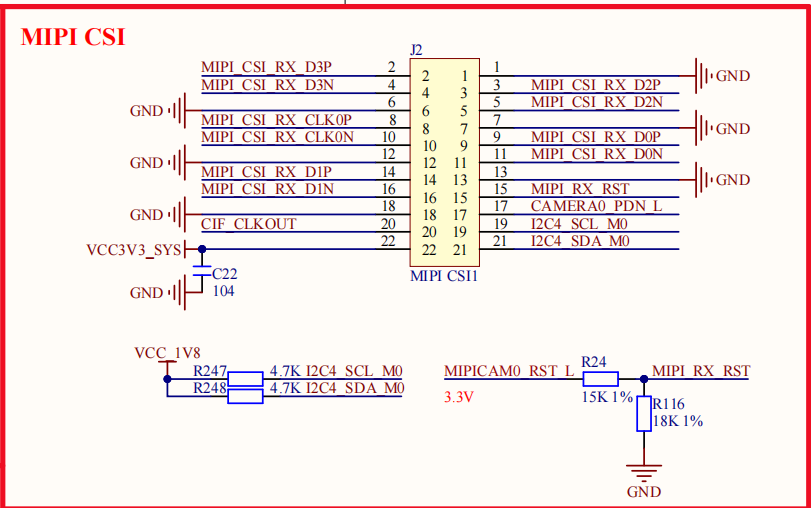
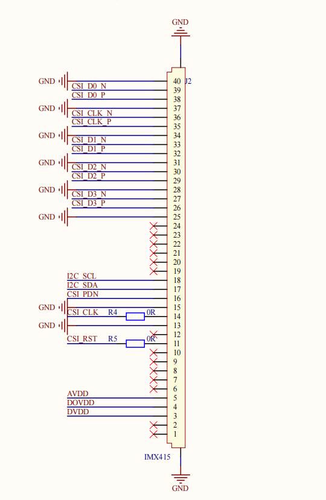
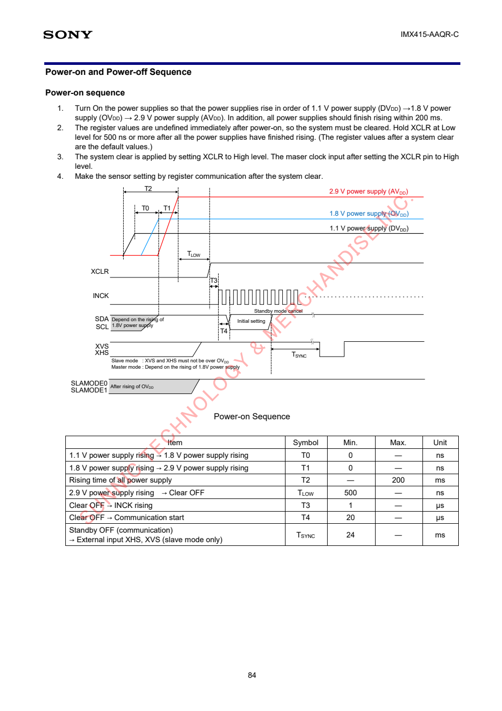

# Camera 驱动第 1 章：IMX415 Sensor 与驱动

> 学习总入口：[[RK3568-Camera驱动学习总入口]]

> 目标：用当前 RK3568 + IMX415 的真实原理图、DTS、内核源码和板端输出，解释 Sensor 如何从硬件连接变成 `/dev/video0`。

## 0. 一条主线

```text
原理图
→ BoardConfig / DTS
→ I2C client：4-001a-1
→ compatible 匹配
→ imx415_probe()
→ V4L2 subdev
→ CSI-2 D-PHY / RKISP
→ /dev/video0
```

本文按这条顺序阅读。每个结论至少对应一种证据：原理图位置、源码行号或板端输出。

## 1. 当前板型的源码入口

SDK：

```text
/home/rk3568/work/rk3568_linux_sdk
```

板级配置：

```text
device/rockchip/rk356x/BoardConfig-rk3568-atk-evb1-ddr4-v10.mk
```

其中指定：

```makefile
RK_KERNEL_DTS=rk3568-atk-evb1-ddr4-v10-linux
```

因此最终 DTS 是：

```text
kernel/arch/arm64/boot/dts/rockchip/rk3568-atk-evb1-ddr4-v10-linux.dts
```

它继续包含：

```dts
#include "rk3568-atk-evb1-ddr4-v10.dtsi"
```

IMX415 的实际板级配置位于：

```text
kernel/arch/arm64/boot/dts/rockchip/rk3568-atk-evb1-ddr4-v10.dtsi
```

注意：源码中没有 `rk3568-atk-evb1-ddr4-v10.dts`，不要找错文件名。

## 2. 原理图到 DTS：硬件为什么这样配置

### 2.1 两份原理图的位置

| 对象 | 文件 | 重点位置 |
|---|---|---|
| RK3568 底板 | `E:\【正点原子】RK3568开发板资料（A盘）-基础资料\02、开发板原理图\01、底板原理图\ATK-DLRK3568 V1.5(底板原理图).pdf` | 第 4 页，右上角 `MIPI CSI`，连接器 J2 |
| IMX415 模组 | `E:\【正点原子】RK3568开发板资料（A盘）-基础资料\02、开发板原理图\03、其它模块原理图\ATK-MCIMX415 V1.4 原理图.pdf` | 第 2 页，中间 J3 和右侧 IMX415 |

主板 MIPI CSI 接口：



IMX415 Sensor 引脚：



### 2.2 唯一硬件映射表

| IMX415 模组信号   | 主板网络                 | DTS 表达                                                | 驱动中的资源/用途             |
| ------------- | -------------------- | ----------------------------------------------------- | --------------------- |
| `I2C_SCL/SDA` | `I2C4_SCL_M0/SDA_M0` | Sensor 节点放在 `&i2c4` 下                                 | I2C 寄存器读写             |
| I2C 地址        | 硬件地址 `0x1a`          | `reg = <0x1a>`                                        | `client->addr = 0x1a` |
| `CSI_RST`     | `MIPICAM0_RST_L`     | `reset-gpios = <&gpio3 RK_PB6 GPIO_ACTIVE_LOW>`       | `reset_gpio`          |
| `CSI_PDN`     | `CAMERA0_PDN_L`      | `power-gpios = <&gpio4 RK_PB4 GPIO_ACTIVE_HIGH>`      | `power_gpio`          |
| Sensor 输入时钟   | `CIF_CLKOUT`         | `clocks = <&cru CLK_CIF_OUT>`、`clock-names = "xvclk"` | `xvclk`               |
| `CSI_D0~D3`   | `MIPI CSI RX D0~D3`  | `data-lanes = <1 2 3 4>`                              | 4 Lane MIPI 图像数据      |
| `CSI_CLK`     | MIPI Clock Lane      | endpoint 连接                                           | MIPI 高速链路时钟           |
|               |                      |                                                       |                       |

GPIO 的确认顺序是：

```text
模组信号
→ 主板连接器网络名
→ RK3568 管脚
→ DTS GPIO 属性
→ imx415.c 获取资源
```

它们不是在 DTS 中随意选择的。

### 2.3 电源与时钟的特殊点

IMX415 模组使用 VCC3.3，通过板载 LDO 生成：

```text
VCC3.3
├── XC6206P282MR → AVDD  ≈ 2.8V
├── XC6206P182MR → DOVDD ≈ 1.8V
└── XC6206P122MR → DVDD  ≈ 1.2V
```

因此当前 DTS 没有提供 `avdd-supply`、`dovdd-supply`、`dvdd-supply`。驱动退回 dummy regulator，但模组仍由板载 LDO 供电，所以这不是当前故障。

模组上的 `24MHZ/NC` 标记为不装，实际外部时钟由 RK3568 的 `CIF_CLKOUT` 提供。

### 2.4 Sony 芯片上电时序与 ATK 模组控制

> [!important] 先记结论
> `power-gpios` 只对应一根 `CSI_PDN` 控制线，不能分别控制 `DVDD`、`OVDD/DOVDD`、`AVDD` 三路电源，也不能把它直接等同于 Sony 上电时序图中的三条电源曲线。

Sony IMX415 Datasheet 第 84 页给出的是**裸 Sensor 从完全断电到允许寄存器通信的电气时序**，不是 RK3568 GPIO 调用时序，也不是 MIPI 图像传输时序。

原始资料：

```text
E:\【正点原子】RK3568开发板资料（A盘）-基础资料
\07、硬件资料\06、模块资料
\【正点原子】ATK-MCIMX415摄像头模块
\2，IMX415参考资料
\IMX415-AAQR-C_Datasheet_E19504(产品信息).pdf
```



#### 2.4.1 Sony 图中各信号代表什么

| Sony 图中的信号 | 含义 | 当前硬件/驱动中的对应对象 |
|---|---|---|
| `DVDD 1.1V` | Sensor 数字内核电源 | 模组 `DVDD≈1.2V`，由 XC6206P122MR 产生 |
| `OVDD 1.8V` | Sensor I/O 电源 | 模组 `DOVDD≈1.8V`，由 XC6206P182MR 产生 |
| `AVDD 2.9V` | Sensor 模拟电源 | 模组 `AVDD≈2.8V`，由 XC6206P282MR 产生 |
| `XCLR` | 低电平复位，高电平解除复位 | `CSI_RST` → `reset-gpios` → `reset_gpio` |
| `INCK` | Sensor 外部主时钟 | `CIF_CLKOUT` → `xvclk` |
| `SDA/SCL` | 寄存器通信 | `I2C4_SDA/SCL` |
| `CSI_PDN` | Sony 图中没有这根同名信号 | ATK 模组级使能/掉电控制 → `power-gpios` |

Sony 图没有单独的 `POWER` 引脚。图顶部三条从 0V 上升到目标电压的曲线，本身就是电源状态变化。Sony 的 RESET 也不叫 `RESET`，而叫 `XCLR`：

```text
XCLR = Low  → 保持复位
XCLR = High → Clear OFF，解除复位
```

#### 2.4.2 Sony 规定的最低时间

```text
DVDD 上升
→ OVDD 上升
→ AVDD 上升
→ XCLR 从 Low 变为 High
→ 输入 INCK
→ 开始 I2C 通信
→ 写初始化寄存器
```

| 参数 | 含义 | 要求 |
|---|---|---:|
| `T0` | DVDD 上升到 OVDD 上升 | ≥ 0ns，DVDD 不能晚于 OVDD |
| `T1` | OVDD 上升到 AVDD 上升 | ≥ 0ns，OVDD 不能晚于 AVDD |
| `T2` | 三路电源全部上升完成 | ≤ 200ms |
| `TLOW` | AVDD 上升完成到 XCLR 解除 | ≥ 500ns |
| `T3` | XCLR 解除到 INCK 输入 | ≥ 1μs |
| `T4` | XCLR 解除到开始 I2C 通信 | ≥ 20μs |

#### 2.4.3 当前模组为什么只有一个 `power-gpios`

当前 DTS：

```dts
reset-gpios = <&gpio3 RK_PB6 GPIO_ACTIVE_LOW>;
power-gpios = <&gpio4 RK_PB4 GPIO_ACTIVE_HIGH>;
```

只描述两根 GPIO：

```text
GPIO3_B6 → CSI_RST/XCLR → Sensor 复位
GPIO4_B4 → CSI_PDN      → 模组级使能/掉电控制
```

三路真实供电来自模组上的 VCC3.3 和三颗 LDO：

```text
VCC3.3
├── XC6206P282MR → AVDD
├── XC6206P182MR → DOVDD
└── XC6206P122MR → DVDD
```

三颗 LDO 没有独立的 EN 控制脚，因此 RK3568 不能通过一个 `power_gpio` 分别安排三路电源的先后顺序。ATK 规格书把 `CSI_PDN` 描述为“控制信号，使能模组电源”，但不能据此把它理解成 Sony 三路电源的独立时序控制器。

如果三路电源由 SoC 可控 regulator 提供，DTS 才会分别出现：

```dts
avdd-supply = <&vcc_camera_2v8>;
dovdd-supply = <&vcc_camera_1v8>;
dvdd-supply = <&vcc_camera_1v2>;
```

当前 DTS 没有这三个属性，所以 `regulator_bulk_enable()` 操作的是 dummy regulator，不会改变真实电压。Sony 要求的三路电源上升过程由 VCC3.3、模组 LDO 及硬件特性负责，不是由 `power_gpio` 完成。

#### 2.4.4 驱动代码实际执行的控制时序

`__imx415_power_on()` 执行的是 RK3568 能控制的模组级动作：

```text
regulator_bulk_enable()
→ 当前为 dummy，对真实硬件无动作

power_gpio = 1
→ GPIO4_B4 物理高电平
→ CSI_PDN 进入模组使能状态

等待 10～20ms

reset_gpio = 0
→ 因为 GPIO_ACTIVE_LOW，逻辑 0 对应物理高电平
→ XCLR 从 Low 变 High，解除复位

等待 10～20ms
→ 设置并打开 xvclk/INCK

等待 20～30ms
→ 允许 I2C 读取 Sensor ID
```

`__imx415_power_off()` 则反向处理：

```text
reset_gpio = 1
→ 物理低电平，XCLR 复位有效
→ 关闭 xvclk
→ power_gpio = 0
→ 关闭模组级使能
```

> [!warning] 不要错误表述
> 不能说“`power_gpio = 1` 按顺序打开了 DVDD、DOVDD、AVDD”。准确说法是：“模组三路真实电源由 VCC3.3 和板载 LDO 提供；驱动通过 `CSI_PDN`、`CSI_RST/XCLR` 和 `xvclk` 完成它能够控制的使能、复位与时钟时序。”

这也解释了为什么 `Detected imx415 id 0000e0` 能够出现：三路真实供电已经存在，驱动完成了模组使能、解除复位和时钟输入，随后 I2C 成功读取芯片 ID。但它仍不能证明 MIPI 已经输出图像。

## 3. IMX415 设备树节点

位置：

```text
rk3568-atk-evb1-ddr4-v10.dtsi
&i2c4：约第 574 行
imx415：约第 650 行
```

```dts
&i2c4 {
    status = "okay";

    imx415: imx415@1a {
        status = "okay";
        compatible = "sony,imx415";
        reg = <0x1a>;
        clocks = <&cru CLK_CIF_OUT>;
        clock-names = "xvclk";
        power-domains = <&power RK3568_PD_VI>;
        pinctrl-names = "rockchip,camera_default";
        pinctrl-0 = <&cif_clk>;
        reset-gpios = <&gpio3 RK_PB6 GPIO_ACTIVE_LOW>;
        power-gpios = <&gpio4 RK_PB4 GPIO_ACTIVE_HIGH>;
        rockchip,camera-module-index = <0>;
        rockchip,camera-module-facing = "back";
        rockchip,camera-module-name = "CMK-OT1522-FG3";
        rockchip,camera-module-lens-name = "CS-P1150-IRC-8M-FAU";

        port {
            imx415_out: endpoint {
                remote-endpoint = <&mipi_in_ucam1>;
                data-lanes = <1 2 3 4>;
            };
        };
    };
};
```

### 每组属性负责什么

| 属性组                         | 作用                      | 直接影响                  |
| --------------------------- | ----------------------- | --------------------- |
| `status`                    | 是否启用控制器和 Sensor 节点      | 是否创建设备                |
| `compatible`                | 与驱动 `of_match_table` 匹配 | 是否绑定 `imx415` 驱动      |
| `reg`                       | I2C 从地址                 | 创建地址为 `0x1a` 的 client |
| `clocks`、`pinctrl`          | 指定并复用 Sensor 外部时钟引脚     | MCLK                  |
| `power-domains`             | 使用 RK3568 VI 电源域        | SoC Camera/ISP 相关硬件域  |
| `reset-gpios`、`power-gpios` | 描述板级控制线                 | RESET、PDN/使能          |
| `camera-module-*`           | Rockchip 模组元数据          | subdev 名称、朝向、镜头信息     |
| `port/endpoint`             | 描述图像数据连向谁               | Sensor → CSI-2 D-PHY  |
| `data-lanes`                | 指定 MIPI 数据 Lane         | 4 Lane 接收配置           |

为什么整个节点写在 `&i2c4` 下面：

```text
父节点描述“如何控制和配置 Sensor”——I2C4
port/endpoint 描述“图像数据发向哪里”——MIPI CSI-2
```

这就是一颗 Sensor 同时使用两条通道：

```text
I2C4       → 低速控制：读写寄存器、设置曝光/增益/模式、读取 Sensor ID
MIPI CSI-2 → 高速数据：传输 IMX415 输出的 RAW10 图像
```

图像数据不会经过 I2C；`port/endpoint` 放在 I2C 设备节点中，只是为了完整描述这颗 Sensor 的数据连接。

## 4. 从 DTS 到 `imx415_probe()`

### 4.1 函数调用流程图

> 网页大图： [打开 IMX415 三层驱动调用流程](../04-项目/16-IMX415-三层驱动调用流程.html)

### 4.2 四个角色分别干什么

| 模块           | 大白话角色            | 它知道什么                                                | 它不负责什么                                      |
| ------------ | ---------------- | ---------------------------------------------------- | ------------------------------------------- |
| Linux 通用驱动模型 | 管理员、调度中心         | 系统中有哪些 `device`、有哪些 `driver`、它们属于哪种总线                | 不懂 I2C 的 `compatible` 怎么比较，也不会操作 IMX415 寄存器 |
| I2C Core     | I2C 专业中介、翻译员     | I2C 设备怎样创建、I2C 驱动怎样匹配、怎样把通用 `device` 转成 `i2c_client` | 不知道 IMX415 的具体上电时序和寄存器                      |
| `i2c_client` | IMX415 的设备档案     | I2C4、地址 `0x1a`，以及指向 DTS 节点的 `dev.of_node`            | 它只是数据对象，不会主动匹配驱动或初始化硬件                      |
| IMX415 驱动    | 真正干活的 Sensor 工程师 | IMX415 需要什么时钟、GPIO、寄存器和 ID                           | 不负责管理全系统的设备与驱动                              |

`I2C Core` 是内核框架；`i2c_client` 是它根据 DTS 创建的设备对象，二者不是同一个东西。

### 4.3 注册、创建设备与匹配

先分清本轮最关键的疑问：

```text
驱动是否注册 → 由内核配置和模块是否加载决定
匹配哪个驱动 → 由 i2c_client 关联的 DTS 信息和驱动匹配表决定
```

不是 DTS 发现 IMX415 后，系统才选择注册 IMX415 驱动。所有已经编入内核或已经加载的 Sensor 驱动都会各自注册并等待设备；这里的“所有”只包括内核配置启用的驱动，不是源码目录中的全部驱动。

驱动注册和设备创建是两条独立路径，先后顺序不固定：

```text
驱动路径                              设备路径
CONFIG_VIDEO_IMX415=y                DTS：&i2c4 / imx415@1a
→ sensor_mod_init()                  → 创建 i2c_client
→ 注册 imx415_i2c_driver             → 保存 I2C4、0x1a、dev.of_node
              \                      /
               \                    /
                → compatible 匹配 ←
                  "sony,imx415"
                         ↓
                  imx415_probe()
```

第一步，IMX415 驱动先填写一张工作登记表：

```c
static struct i2c_driver imx415_i2c_driver = {
    .driver.of_match_table = imx415_of_match,
    .probe = imx415_probe,
    .remove = imx415_remove,
};
```

它表达的是：

```text
我能处理 compatible = "sony,imx415" 的设备；
设备交给我时，请调用 imx415_probe()；
设备解绑时，请调用 imx415_remove()。
```

第二步，`sensor_mod_init()` 把登记表交给 I2C Core：

```text
sensor_mod_init()
→ i2c_add_driver()
→ i2c_register_driver()
```

I2C Core 给它盖章：

```c
driver->driver.bus = &i2c_bus_type;
```

意思是：“这是一个 I2C 驱动，以后使用 I2C 的匹配和 probe 规则。”

第三步，另一条路径根据 DTS 创建真实设备的软件代表：

```text
imx415@1a
→ i2c_new_device()
→ struct i2c_client
→ 4-001a-1
```

这个 client 同样标记为属于 `i2c_bus_type`。

第四步，Linux 通用驱动模型看到同一条 I2C 总线中已经同时存在：

```text
设备：4-001a-1
驱动：imx415_i2c_driver
```

但通用驱动模型不会比较 I2C 的 `compatible`，于是它问 I2C Core：

```text
driver_match_device()
→ i2c_bus_type.match
→ i2c_device_match()
```

第五步，I2C Core 比较：

```text
DTS：    sony,imx415
驱动表： sony,imx415
```

匹配成功后，结果交回通用驱动模型。

第六步，通用驱动模型决定执行 probe，但它只认识通用的 `struct device`：

```text
driver_probe_device()
→ really_probe()
→ i2c_bus_type.probe
→ i2c_device_probe(struct device *dev)
```

第七步，I2C Core 充当翻译员：

```text
通用 struct device
→ 转成 struct i2c_client
→ 找到 imx415_i2c_driver.probe
```

然后执行：

```c
driver->probe(client, i2c_match_id(driver->id_table, client));
```

由于 `driver->probe` 保存的就是 `imx415_probe`，所以最终等价于：

```c
imx415_probe(client, id);
```

这时才轮到 IMX415 驱动真正操作硬件：获取时钟和 GPIO、上电、读取 `0000e0`、注册 V4L2 subdev。

### 4.4 为什么有两个 `probe`

```text
i2c_bus_type.probe = i2c_device_probe
```

这是 I2C Core 的通用入口，负责“翻译对象并转交任务”。

```text
imx415_i2c_driver.probe = imx415_probe
```

这是具体 Sensor 驱动入口，负责“真正初始化 IMX415”。

因此调用关系必须读成：

```text
Linux 通用驱动模型
→ I2C Core 的 i2c_device_probe()
→ IMX415 驱动的 imx415_probe()
```

### 4.5 `compatible` 如何匹配

DTS：

```dts
compatible = "sony,imx415";
```

驱动：

```c
static const struct of_device_id imx415_of_match[] = {
    { .compatible = "sony,imx415" },
    {},
};
```

两者相同，`i2c_device_match()` 才允许继续绑定。但这只是软件匹配，不证明真实硬件存在。

### 4.6 `struct i2c_client` 与信息来源

它代表内核中的一个 I2C 从设备实例：

```text
client->adapter      → I2C4
client->addr         → 0x1a
client->dev.of_node  → /i2c@fe5d0000/imx415@1a
```

运行时目录：

```text
/sys/bus/i2c/devices/4-001a-1
```

其中 `4` 是 I2C adapter 编号，`001a` 是地址 `0x1a`。末尾 `-1` 属于当前 Rockchip 厂商驱动的实例命名部分，本阶段不依靠它判断总线或地址。

匹配和 `probe()` 使用的是同一个 DTS 节点，不是重新生成一份配置。I2C Core 把这个节点关联到 client，匹配成功后再把 client 传给驱动：

```c
struct device *dev = &client->dev;
struct device_node *node = dev->of_node;
```

| 角色           | 信息从哪里来                                             | 最终得到什么                                             |
| ------------ | -------------------------------------------------- | -------------------------------------------------- |
| I2C Core     | 解析 I2C4 下的 DTS 子节点                                 | 创建 `i2c_client`，组织匹配并转交 probe                      |
| `i2c_client` | 由 I2C Core 根据 DTS 填充                               | `adapter=I2C4`、`addr=0x1a`、`dev.of_node→imx415@1a` |
| IMX415 驱动    | 固定知识来自 `imx415.c`；板级信息通过 client 获取；真实 ID 通过 I2C 读取 | 寄存器表、模式、GPIO、时钟、电源以及实际 Sensor ID                   |

IMX415 驱动获得信息的入口：

```text
client->adapter     → 选择 I2C4
client->addr        → 访问 0x1a
client->dev.of_node → 读取 GPIO、时钟、模组信息和 endpoint
imx415.c            → 提供寄存器地址、模式表、预期 Sensor ID
真实 IMX415         → 通过 I2C 返回实际 Sensor ID
```

## 5. endpoint：图像数据接到哪里

Sensor 输出端：

```dts
imx415_out: endpoint {
    remote-endpoint = <&mipi_in_ucam1>;
    data-lanes = <1 2 3 4>;
};
```

CSI-2 D-PHY 两端位于同一个 `.dtsi` 约第 231～269 行：

```dts
&csi2_dphy0 {
    ports {
        port@0 {
            mipi_in_ucam1: endpoint@2 {
                remote-endpoint = <&imx415_out>;
                data-lanes = <1 2 3 4>;
            };
        };

        port@1 {
            csidphy_out: endpoint@0 {
                remote-endpoint = <&isp0_in>;
            };
        };
    };
};
```

| 概念                | 含义                    |
| ----------------- | --------------------- |
| `port`            | 设备的一个数据接口             |
| `endpoint`        | 该接口上的具体连接端点           |
| `remote-endpoint` | 对方 endpoint 的 phandle |
| `data-lanes`      | 使用哪些 MIPI 数据 Lane     |

完整数据连接：

```text
imx415_out
↔ mipi_in_ucam1
→ rockchip-csi2-dphy0
→ csidphy_out
↔ isp0_in
→ RKISP
```

检查 endpoint 只看三点：

1. Sensor 与 D-PHY 输入端是否互相引用。
2. 两端 `data-lanes` 是否一致。
3. D-PHY 输出端是否连接 `isp0_in`。

endpoint 写错不会阻止 I2C 读取 Sensor ID，但会导致 Media Graph 无法形成完整图像链路。

## 6. `imx415_probe()`：真实硬件初始化

驱动文件：

```text
kernel/drivers/media/i2c/imx415.c
```

关键入口：

|     位置 | 内容                         |
| -----: | -------------------------- |
| `2429` | `imx415_probe()`           |
| `2478` | 获取 `xvclk`                 |
| `2484` | 获取 reset GPIO              |
| `2487` | 获取 power GPIO              |
| `2507` | 获取 dvdd/dovdd/avdd         |
| `2521` | `__imx415_power_on()`      |
| `2525` | `imx415_check_sensor_id()` |
| `2551` | 注册异步 V4L2 subdev           |
| `2598` | `imx415_of_match[]`        |
| `2610` | `imx415_i2c_driver`        |
| `2621` | `sensor_mod_init()`        |

### 6.1 probe 的有效阅读顺序

| 顺序 | 动作 | 对应 DTS/硬件 |
|---:|---|---|
| 1 | 读取模组编号、朝向、名称、镜头 | `rockchip,camera-module-*` |
| 2 | 选择 HDR/默认模式 | `hdr-mode`，缺省为非 HDR |
| 3 | 获取时钟、GPIO、pinctrl、regulator | MCLK、RESET、PDN、电源 |
| 4 | 初始化 V4L2 subdev 和 controls | 曝光、增益、VBlank 等 |
| 5 | `__imx415_power_on()` | 执行 GPIO、供电、MCLK 时序 |
| 6 | `imx415_check_sensor_id()` | 通过 I2C 读取芯片 ID |
| 7 | 初始化 Media Pad | Sensor 是 Source entity |
| 8 | 异步注册 V4L2 subdev | 等待 CSI/ISP 完成绑定 |
| 9 | 启用 Runtime PM，返回 0 | probe 完成 |

第一次阅读可以暂时跳过 `devm_kzalloc`、mutex、`memset`、`snprintf` 和错误清理标签；先吃透第 3～8 步。

### 6.2 日志和 sysfs 分别证明什么

| 板端证据                              | 能证明什么                    | 不能证明什么         |
| --------------------------------- | ------------------------ | -------------- |
| 运行时节点存在                           | DTB 中启用了 `imx415@1a`     | 硬件是否存在         |
| `/sys/bus/i2c/devices/4-001a-1`   | I2C client 已创建           | Sensor 是否响应    |
| `DRIVER=imx415`                   | compatible 匹配并完成驱动绑定     | 芯片型号是否正确       |
| `Detected imx415 id 0000e0`       | 已上电并通过真实 I2C 读到正确 ID     | MIPI 是否已有图像    |
| `dphy0 matches m00_b_imx415`      | D-PHY 找到 Sensor endpoint | RKISP 主路径是否可采集 |
| `Async subdev notifier completed` | Sensor、CSI、ISP 异步绑定完成    | 实际帧内容是否正确      |
| `/dev/video0` 可查询并抓帧              | V4L2 主路径可以提供数据           | 图像质量是否合格       |

板端真实证据：

```text
OF_FULLNAME=/i2c@fe5d0000/imx415@1a
OF_COMPATIBLE_0=sony,imx415
DRIVER=imx415
imx415 4-001a-1: Detected imx415 id 0000e0
rkisp-vir0: Async subdev notifier completed
```

必须区分：

```text
compatible 匹配成功 ≠ 真实 Sensor 已响应
读到 Sensor ID      ≠ MIPI 已经出图
Media Graph 完整    ≠ 图像内容一定正确
```

## 7. 内核配置与 `/dev/video0`

IMX415 驱动的编译关系：

```text
kernel/arch/arm64/configs/rockchip_linux_defconfig:347
    CONFIG_VIDEO_IMX415=y

kernel/drivers/media/i2c/Kconfig:849
    config VIDEO_IMX415

kernel/drivers/media/i2c/Makefile:166
    obj-$(CONFIG_VIDEO_IMX415) += imx415.o
```

三种配置状态：

```text
CONFIG_VIDEO_IMX415=y
→ 编进内核
→ 开机执行初始化函数并注册驱动

CONFIG_VIDEO_IMX415=m
→ 编译为 imx415.ko
→ 模块加载后才注册驱动

# CONFIG_VIDEO_IMX415 is not set
→ 不参与编译
→ 系统中没有这个驱动
```

当前 SDK 是 `=y`：IMX415 驱动在启动阶段独立注册，DTS 负责创建 `i2c_client`；两者之后再通过 `compatible` 匹配。

运行时 Media Graph：

```text
m00_b_imx415
→ rockchip-csi2-dphy0
→ rkisp-csi-subdev
→ rkisp-isp-subdev
→ rkisp_mainpath
→ /dev/video0
```

格式变化：

```text
IMX415 输出 SGBRG10_1X10（RAW10）
→ RKISP 处理
→ /dev/video0 输出 NV12
```

所以 `/dev/video0` 不是 Sensor 驱动单独创建的。Sensor 驱动注册的是 V4L2 subdev；RKISP 主路径注册视频采集节点。

## 8. 新板卡固定排查顺序

1. 原理图：确认电源、MCLK、RESET、PWDN、I2C 和 MIPI Lane。
2. BoardConfig：确认 `RK_KERNEL_DTS`。
3. DTS/DTSI：确认 I2C 节点、`compatible`、`reg` 和硬件资源。
4. I2C client：确认 `/sys/bus/i2c/devices/<bus>-<addr>`。
5. 驱动匹配：确认 `DRIVER`、`of_match_table` 和 `probe` 日志。
6. Sensor ID：确认真实 I2C 通信。
7. endpoint：确认 Sensor、D-PHY、ISP 双向连接。
8. Media Graph：确认 Sensor → CSI → ISP → mainpath。
9. V4L2：确认 `/dev/videoX` 的格式、分辨率、帧率和抓帧结果。

最终必须能按这个顺序回答：

```text
硬件怎么接
→ DTS 为什么这样写
→ 哪个内核对象被创建
→ compatible 如何找到驱动
→ probe 如何验证真实 Sensor
→ endpoint 如何建立数据链路
→ 谁注册 /dev/video0
```

## 9. 岗位化面试复盘

> 本节用于把已经学过的内容转成面试表达，不阻塞第二章学习，也不提前提供标准答案。
>
> 请先保留自己的真实理解。不会的地方可以写“不懂”，回答后再补充高亮正确答案、当前板子证据和面试官追问。

### 第一轮：核心原理

#### 问题 1｜两条初始化路径

开机过程中，DTS 中的 `imx415@1a` 和 `CONFIG_VIDEO_IMX415=y` 分别触发什么？

它们是不是严格按照下面的顺序串行执行？

```text
先创建设备
→ 再注册驱动
→ 再匹配
```

请用 `i2c_client`、`i2c_driver`、I2C 总线匹配和 `probe` 说明真实关系。

**我的回答：**

#### 问题 2｜IMX415 驱动的信息从哪里来

`imx415_probe(struct i2c_client *client, ...)` 开始执行后，下面这些信息分别来自哪里？

```text
I2C 总线号和地址
GPIO、时钟、模组名称和 endpoint
IMX415 寄存器地址、模式表和预期芯片 ID
真实 Sensor 返回的芯片 ID
```

请说明 `client->dev.of_node` 在其中的作用，但不能只回答“都来自 DTS”。

**我的回答：**

#### 问题 3｜probe 与真实硬件验证

请按有效阅读顺序介绍 `imx415_probe()`：

```text
获取资源
→ 初始化 subdev/controls
→ 上电
→ 读取 Sensor ID
→ 注册 Media Entity 和 V4L2 subdev
→ Runtime PM
```

还要回答：

- 为什么 `compatible` 匹配成功不能证明真实 IMX415 存在？
- 为什么当前板子出现 dummy regulator 仍然能读到芯片 ID？
- `Detected imx415 id 0000e0` 能证明什么，不能证明什么？

**我的回答：**

#### 问题 4｜控制流与图像数据流

为什么 IMX415 节点写在 `&i2c4` 下面，但图像数据并不经过 I2C？

请分别说明：

```text
I2C4 / 0x1a
port / endpoint
MIPI CSI-2
V4L2 subdev
```

在整个 Camera 链路中的职责。

**我的回答：**

### 第二轮：故障场景与项目表达

#### 问题 5｜没有 I2C client

运行下面的命令，没有找到 `4-001a-1`：

```bash
ls -l /sys/bus/i2c/devices/
```

这时为什么还不应该直接修改 `imx415_probe()`？请给出从 BoardConfig、运行时设备树到 I2C 控制器的检查顺序，以及每一步想证明什么。

**我的回答：**

#### 问题 6｜已经绑定驱动，但读不到 Sensor ID

运行时已经能看到：

```text
OF_COMPATIBLE_0=sony,imx415
DRIVER=imx415
```

但是没有出现：

```text
Detected imx415 id 0000e0
```

这说明软件链路已经走到哪里？下一步应怎样检查 MCLK、RESET、PWDN/POWER、供电、I2C 地址和 I2C 波形？

请同时说明逻辑分析仪和示波器分别更适合检查哪些信号。

**我的回答：**

#### 问题 7｜拿到新板子和新 Sensor

假设给你一块新 RK3568 板卡和一个新的 MIPI Sensor，要求独立完成 bring-up。请按实际工作顺序说明：

```text
先从原理图确认什么
→ 内核已有 Sensor 驱动时修改什么
→ 内核没有驱动时还要增加什么
→ 怎样判断失败在设备创建、驱动匹配、真实 I2C 通信还是下游图像链路
```

回答必须包含 BoardConfig、DTS/DTSI、Kconfig、Makefile、`of_match_table`、`probe` 和板端最小证据。

**我的回答：**

#### 问题 8｜90 秒项目讲解

请用 60～90 秒向面试官介绍：

> 当前 RK3568 板卡是怎样从原理图和 DTS 描述 IMX415，怎样创建 `i2c_client`、匹配 `imx415_i2c_driver`、执行 `imx415_probe()`，最后把 Sensor 注册成 V4L2 subdev 的？

表达顺序建议使用：

```text
结论
→ 当前板子的硬件和 DTS
→ 设备创建与驱动注册两条起点
→ compatible 匹配与 probe
→ Chip ID 和 subdev 证据
→ 仍然不能证明的下游事项
```

**我的回答：**
